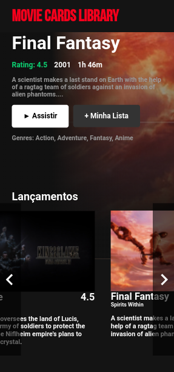

  
  
  

# Boas vindas ao repositório do projeto Movie Cards Library! 📺

  
  

    <h2>Módulo: DESENVOLVIMENTO FRONT-END</h2>
    

      Repositório possuí projeto desenvolvido no período que estive na <b>Trybe</b>, abordando sobre criação de componentes, página e o básico de <b>REACT</b>.

  

   

## Preview

  <a href="https://movie-card-library.herokuapp.com/">Clique aqui</a> para ter acesso a um preview do App.

---

  

## Habilidades
- Saber a melhor forma para instalar um gerenciador de pacotes.
- Inicializar um projeto em React.
- Utilizar JSX no React.
- Utilizar o ReactDOM.render pararenderizar elementos numa página web.
- Utilizar o import para usar código externo junto ao seu.
- Criar componentes React corretamente.
- Fazer uso de props corretamente.
- Fazer composição de componentes.corretamente.
- Criar múltiplos componentes dinamicamente.
- Utilizar PropTypes para checar o tipo de uma prop no uso de um componente.
- Utilizar PropTypes para garantir a presença de props obrigatórias no uso de um componente.
- Utilizar PropTypes para checar que uma prop é um objeto de formato específico.
- Utilizar PropTypes para garantir que uma prop é um array com elementos de um determinado tipo.

## O que foi desenvolvido
- Uma biblioteca de cartões de filmes utilizando React. A biblioteca deverá possuir um cabeçalho e uma lista de cartões. Cada cartão representa um filme e possui uma imagem, título, subtítulo, sinopse e avaliação.

---

 # Instruções para instalar e rodar os testes de cada requisito
1. Clone o repositório
  * `git git@github.com:marlondlacerda/moviecardlibrary.git`
  * Entre na pasta do repositório que você acabou de clonar:
    * `cd moviecardlibrary`

2. Instale as dependências e inicialize o projeto
  * Instale as dependências:
    * `npm install`

3. Use o comando `npm start` para iniciar o aplicativo no navegador.

3. Entre no Vs Code para verificar os arquivos
  * Atalho no terminal: `code . `
  * A pasta test contém os testes que verifica se as funções estão atendendo o que foi pedido

4. Leia os Requisitos do Projeto logo abaixo explicando o que cada requisito propõem

5. Para rodar os tests
  * Atalho no terminal: `npm run test`

***

  
Requisitos do projeto

- [x] 1 - Crie um componente `<Header />`

  Criar um componente que represente o cabeçalho da página.

- [x] 2 - Renderize um texto no `<Header />`

  O texto deverá estar dentro de uma tag `h1`, que por sua vez deve estar dentro de uma tag `header`

- [x] 3 - Crie um componente `<MovieList />`

  Crie um componente que represente toda a área com os cartões de filmes. `<MovieList />` deve receber uma prop `movies`, que é um array de objetos com informações de um filme.

- [x] 4 - Renderize componentes `<MovieCard />` dentro de `<MovieList />`

  `<MovieList />` deve renderizar um componente `<MovieCard />` para cada objeto contido no array recebido na prop `movies`.

- [x] 5 - Passe uma key para cada `<MovieCard />` renderizado

  `<MovieList />` deve renderizar `<MovieCard />`s de forma dinâmica. Ou seja, deve utilizar a função `map` para renderizar uma lista. Cada componente `<MovieCard />` deve receber uma prop `key` com o nome do filme.

- [x] 6 - Crie um componente `<MovieCard />`

  Crie um componente que represente um cartão de filme. `<MovieCard />` deve receber uma prop `movie`. Essa prop será um objeto, contendo as propriedades, `title`, `subtitle`, `storyline`, `imagePath` e `rating`.

- [x] 7 - Renderize a imagem do filme dentro de uma tag `img`

  `<MovieCard />` deve renderizar uma tag `img`, tendo como atributo `src` o valor da propriedade `imagePath` do objeto recebido como prop.

- [x] 8 - Renderize o título do filme dentro de uma tag `h4`

  `<MovieCard />` deve renderizar o título do filme dentro de uma tag `h4`. O título está contido na propriedade `title` do objeto recebido como prop.

- [x] 9 - Renderize o subtítulo do filme dentro de uma tag `h5`

  `<MovieCard />` deve renderizar o subtítulo do filme dentro de uma tag `h5`. O subtítulo está contido na propriedade `subtitle` do objeto recebido como prop.

- [x] 10 - Renderize a sinopse do filme dentro de uma tag `p`

  `<MovieCard />` deve renderizar a sinopse do filme dentro de uma tag `p`. A sinopse está contida na propriedade `storyline` do objeto recebido como prop.

- [x] 11 - Crie um componente `<Rating />`

  Crie um componente que represente a avaliação de um filme.

- [x] 12 - Renderize a nota de um filme dentro de `Rating`

  `<Rating />` deve renderizar a nota do filme recebido na prop `rating` dentro de um elemento com a classe `rating`.

- [x] 13 - Renderize o componente `<Rating />` dentro de `<MovieCard />`

  `<MovieCard />` deve renderizar um componente `<Rating />`.

- [x] 14 - Passe como prop para o componente `<Rating />` o atributo `rating`

  `<MovieCard />` deve passar para o componente `<Rating />` uma prop chamada `rating`. O valor dessa prop é a propriedade `rating` do objeto recebido na prop `movie`.

- [x] 15 - Crie um componente `<App />`

  O componente `<App />` deve renderizar um componente `<Header />`.

- [x] 16 - Renderize `<MovieList />` dentro do componente `<App />`

  O componente `<App />` deve renderizar um componente `<MovieList />`, passando como prop `movies` a lista de filmes contida no arquivo `data.js`. Para isso, você precisará importar `data.js` dentro de `App.js`.

- [x] 17 - Adicione PropTypes a todos os componentes

  Todos os componentes que recebem props devem ter suas proptypes corretamente declaradas. O ESLint checa automaticamente declaração de proptypes, portanto seu Pull Request deverá passar pela verificação do linter para satisfazer esse requisito.

---
# RECURSOS ADICIONAIS DESENVOLVIDOS POR MIM

- Adicionei um novo Component `<FeaturedMovie />`.
  - Esse componente fica responsável de pegar aleatoriamente um dos filmes da biblioteca como uma indicação do que assistir.

- Separei em pastas cada Componente.
  - Desse modo fica melhor a manutenção de cada Componente e seu devido CSS, importação e exportação.

- Layout parecido com Netflix!
  - Fiz o CSS com que parecesse um clone do próprio.
  - Com Javascript e animações de CSS, fiz a  rolagem dos cartões pela lateral.
  - Simulei um carregamento inicial toda vez que a página inicia.
  - Fiz o layout separado para mobile.

- Implementei Docker para que o aplicativo virasse um container.

- Deploy usando Heroku
  - Assim como já peguei um pouco de prática usando vercel, continuei usando o Heroku para praticar mais.

---

  <a href="https://github.com/marlondlacerda/trybe-projetos">Voltar para o repositório principal</a>

  
  [⬆ Voltar para o topo](#boas-vindas-ao-repositório-do-projeto-movie-cards-library-)

